# Diagrammes de Sequence - Smart Farm

هاد الملف فيه diagrammes de sequence ديال المشروع كامل، مقسمين حسب الحالات الرئيسية باش يكونو واضحين فالتقرير/العرض.

> ملاحظة: الدياگرام مكتوب بـ Mermaid. إلا ما بانش مرسوم فـ VS Code، ثبت extension بحال **Markdown Preview Mermaid Support**.

---

## 1. Demarrage General du Systeme

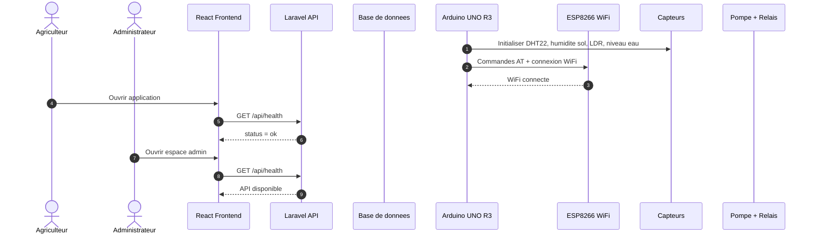

---

## 2. Authentification Utilisateur

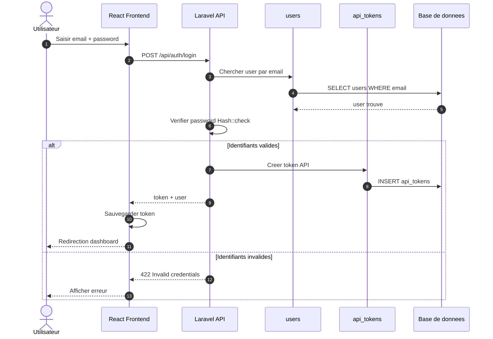

---

## 3. Verification Session / Profil Connecte

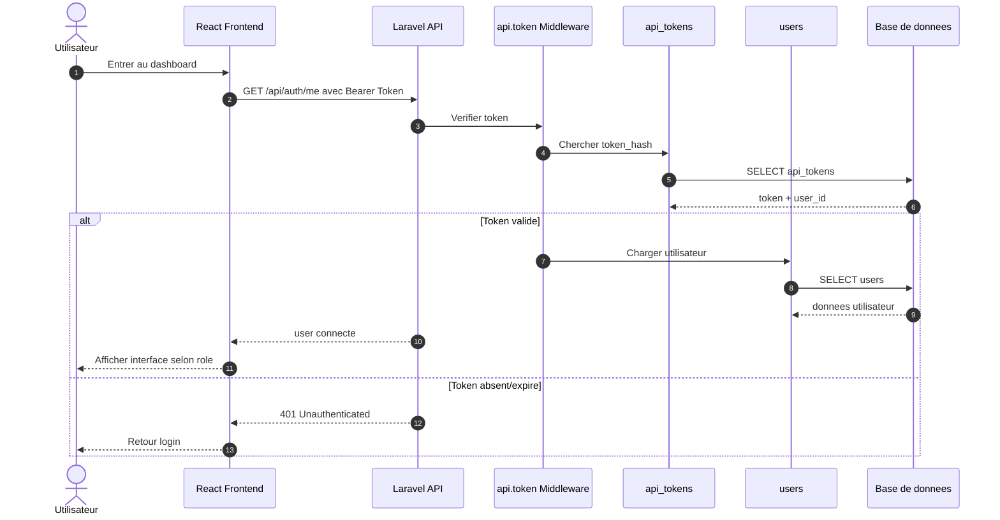

---

## 4. Envoi des Donnees Capteurs par la Maquette

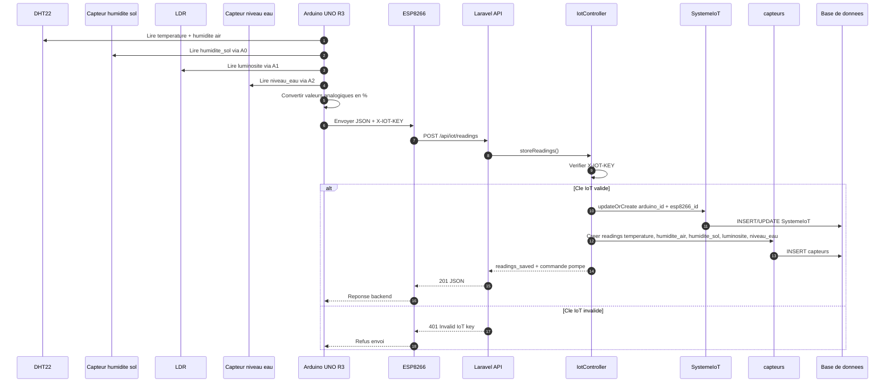

---

## 5. Surveillance Dashboard - Dernieres Valeurs

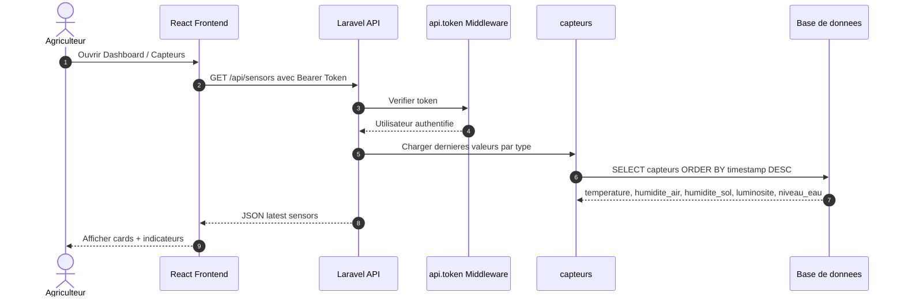

---

## 6. Historique des Capteurs

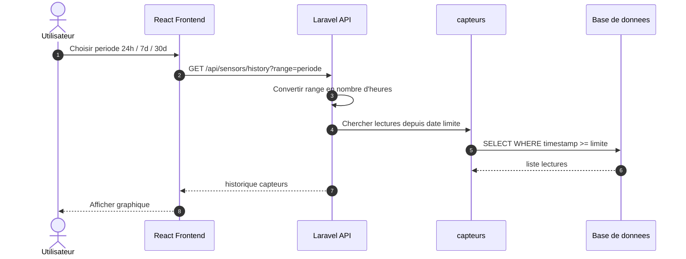

---

## 7. Irrigation Manuelle - Activer Pompe

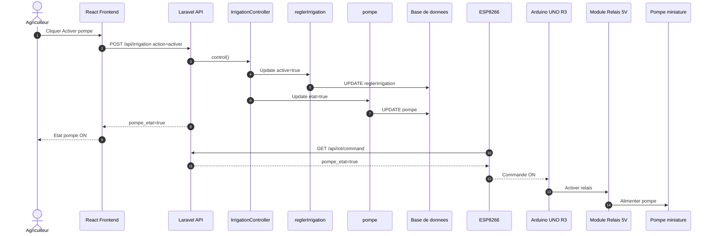

---

## 8. Irrigation Manuelle - Desactiver Pompe

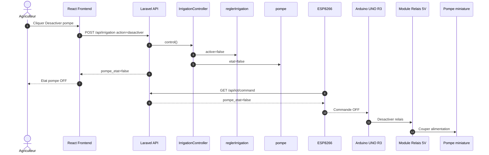

---

## 9. Irrigation Automatique Selon Humidite du Sol

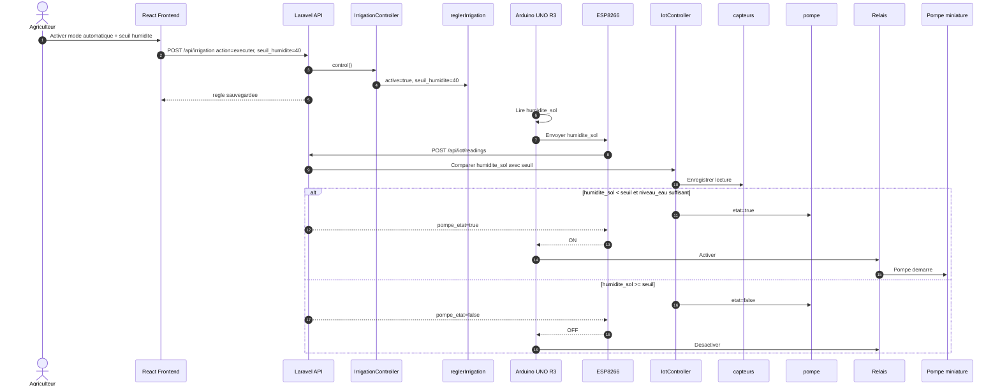

---

## 10. Protection Niveau d'Eau Faible

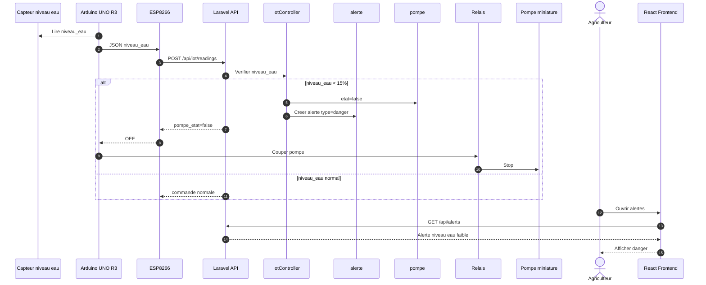

---

## 11. Gestion des Alertes

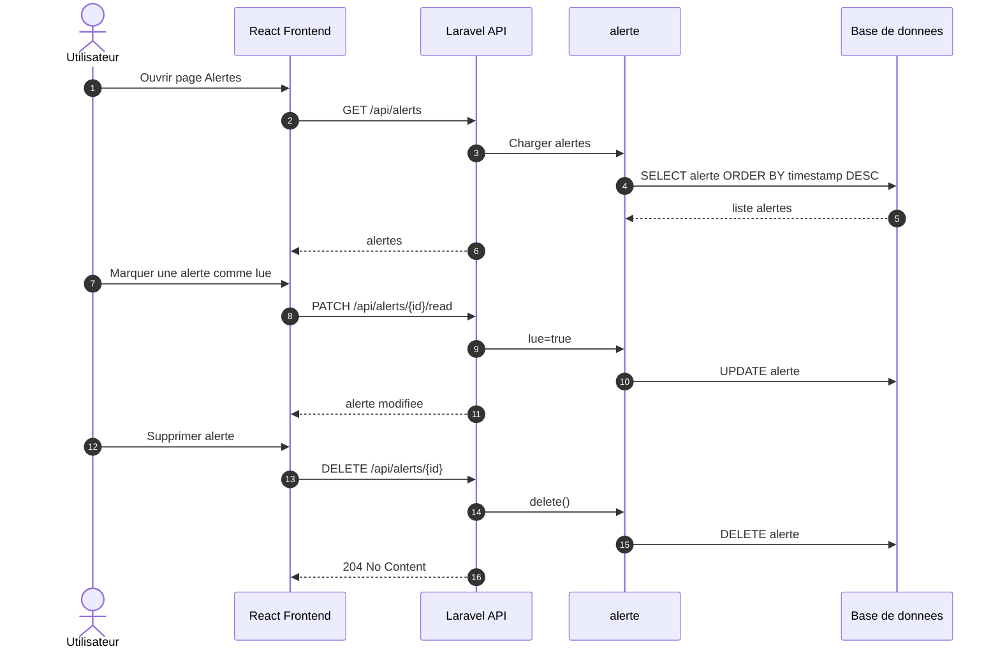

---

## 12. Donnees Meteo

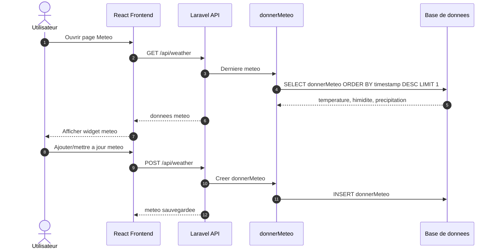

---

## 13. Chat IA

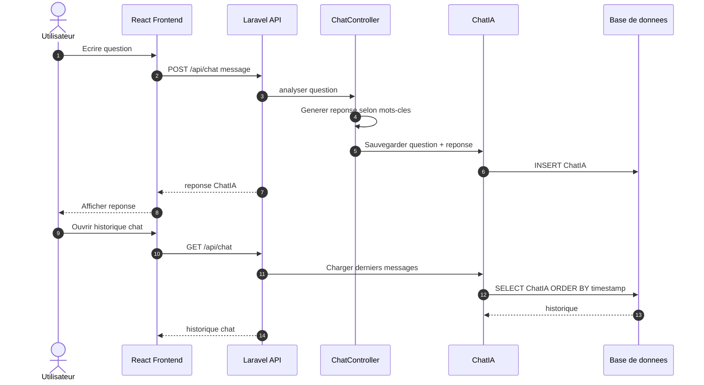

---

## 14. Administration - Gestion Utilisateurs

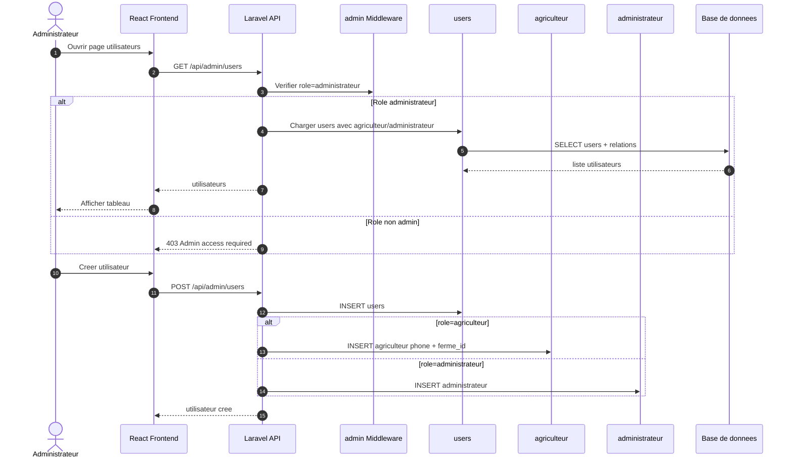

---

## 15. Administration - Systeme IoT

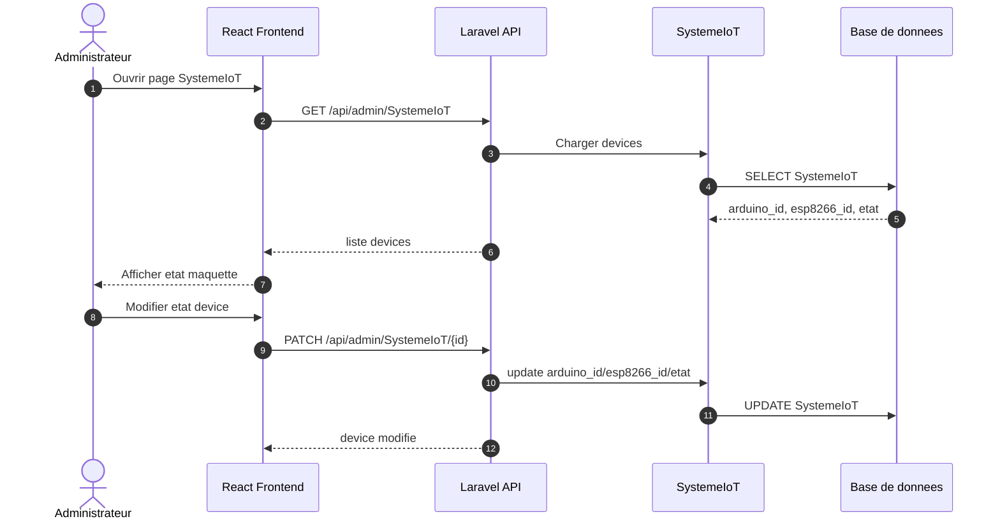

---

## 16. Administration - Rapports

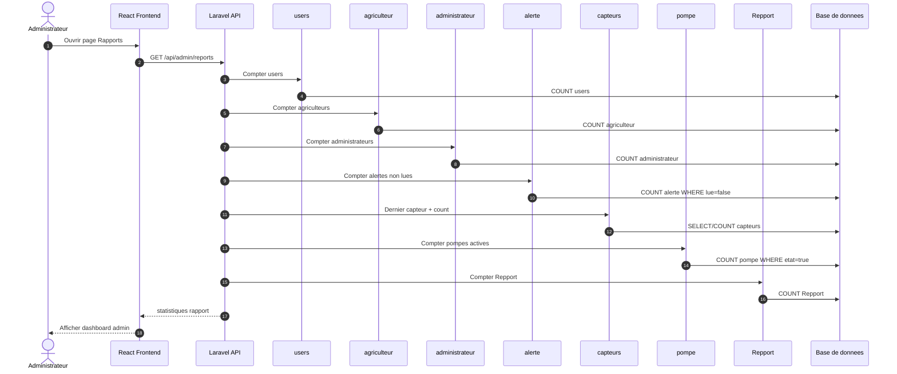

---

## 17. Deconnexion

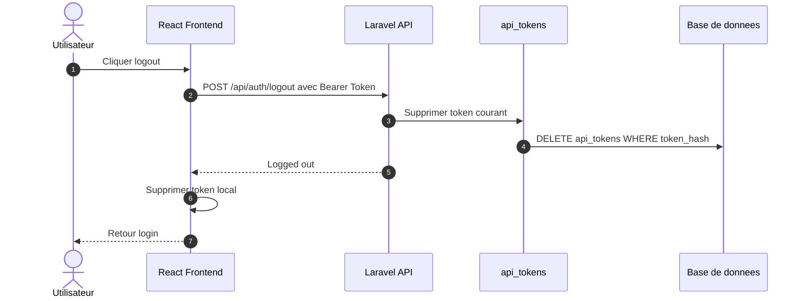

---

## 18. Resume des Acteurs et Responsabilites

| Acteur / Composant | Role |
|---|---|
| Agriculteur | Consulte capteurs, alertes, meteo, chat, controle irrigation |
| Administrateur | Gere utilisateurs, SystemeIoT, rapports |
| React Frontend | Interface utilisateur et appels API |
| Laravel API | Authentification, logique metier, validation, controle irrigation |
| Arduino UNO R3 | Lecture capteurs et commande relais |
| ESP8266 | Connexion WiFi et communication HTTP avec Laravel |
| Capteurs | DHT22, humidite sol, LDR, niveau eau |
| Pompe + Relais | Execution physique de l'irrigation |
| Base de donnees | Stockage users, capteurs, alertes, pompe, regles, IoT, rapports |