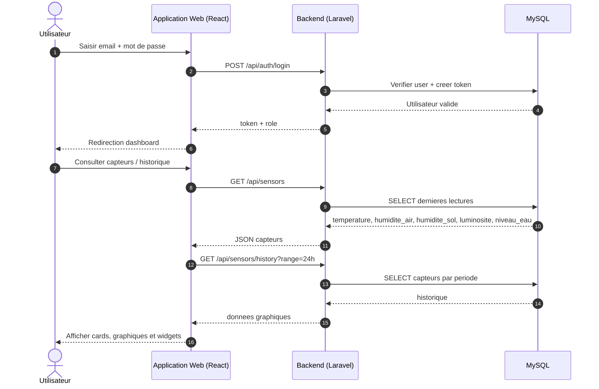
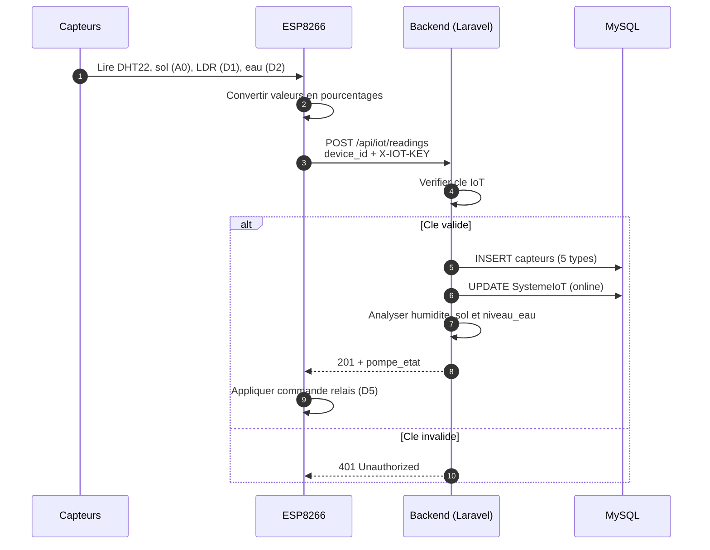
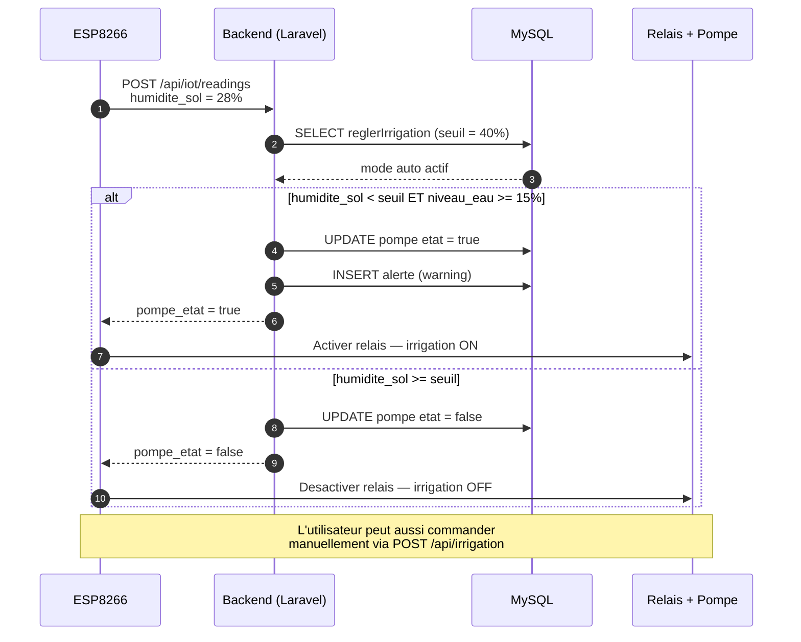
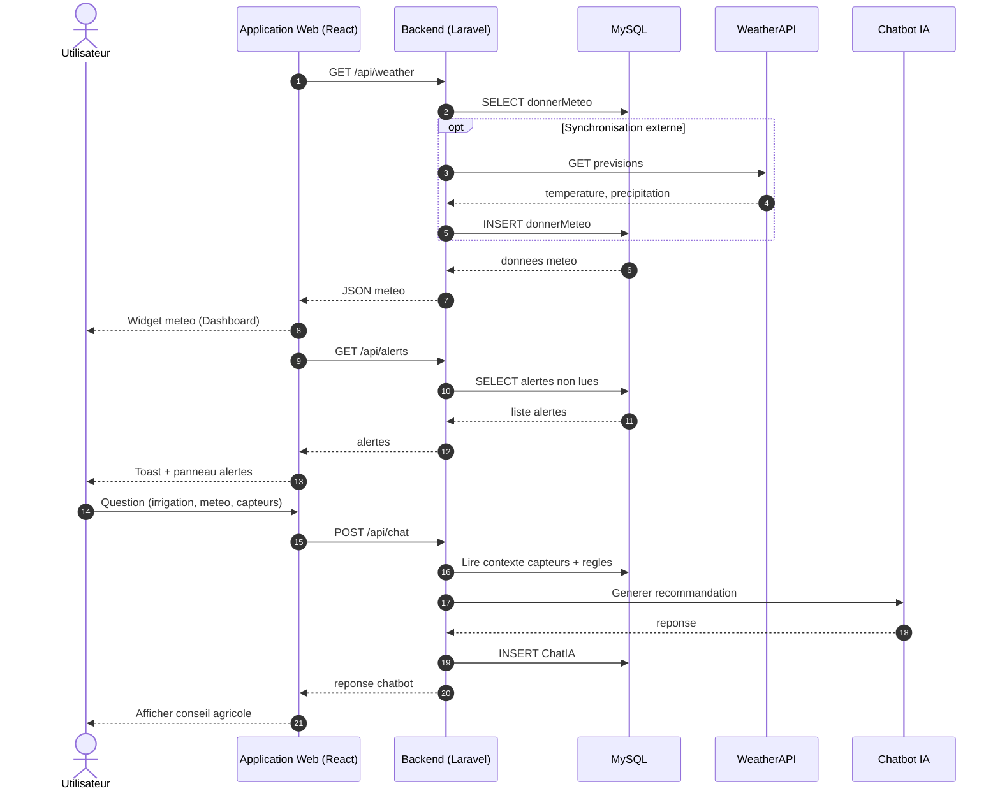

# Diagrammes de Sequence — Smart Farm

4 scenarios principaux du systeme Smart Farm, representes avec **Mermaid**.

> Pour visualiser : ouvrir ce fichier en **Markdown Preview** (extension Mermaid recommandee).

### Acteurs du systeme

| Composant | Role |
|-----------|------|
| **Utilisateur** | Agriculteur ou administrateur |
| **Application Web** | Interface React |
| **Backend** | API Laravel |
| **Base de donnees** | MySQL |
| **Systeme IoT** | ESP8266 + capteurs + relais pompe |
| **WeatherAPI** | API externe meteo (optionnel) |
| **Chatbot IA** | Recommandations agricoles |

---

## Scenario 1 — Consultation des donnees de la ferme

L'utilisateur se connecte et consulte le tableau de bord. L'application Web recupere les dernieres valeurs capteurs stockees par le module IoT.

---

## Scenario 2 — Collecte IoT et enregistrement des capteurs

Le module ESP8266 lit les capteurs, envoie les donnees au backend, qui les enregistre et met a jour l'etat du device.

---

## Scenario 3 — Irrigation automatique (humidite faible)

Si l'humidite du sol est inferieure au seuil configure, le backend active la pompe via le systeme IoT.

---

## Scenario 4 — Meteo, alertes et chatbot

Le systeme affiche la meteo, notifie l'utilisateur en cas d'alerte, et genere des recommandations via le chatbot.

